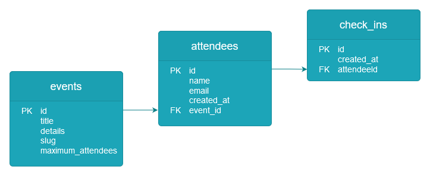
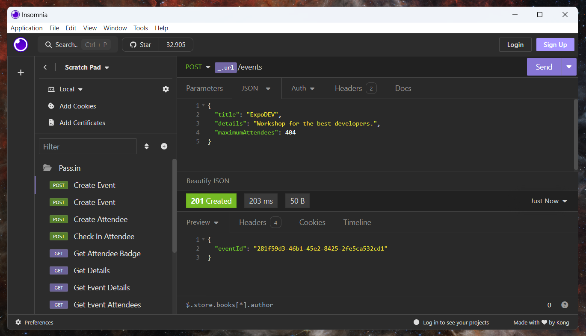

<h1 align="center">
  Pass.in Back-end
  
</h1>

Application for managing participants in in-person events.

     
    
    
    
    
    
    

## About

Pass.in is a check-in system for in-person events where the organizer can control and manage the list of participants
and each person can generate their credential to access the event.

### Functional requirements

- Organizer
    - Must be able to register a new event;
    - Must be able to view event data;
    - Must be able to view the list of participants;
- Attendees
    - Must be able to register for an event;
    - Must be able to view their registration badge;
    - Must be able to check-in at the event;

### Non-functional requirements

- Check-in at the event will be carried out using a QRCode

### Business rules

- The attendees can only register for an event once;
- Attendees can only register for events with available places;
- The attendees can only check-in to an event once;

### Database model

  

## Collection

## How to run

1. Download code base with `git clone`
2. Import project on IntelliJ
3. Download maven dependencies `./mvnw install`
4. Start Spring Boot application `./mvnw spring-boot:run`
5. Do your requests! 🎉

## References

- **Thanking**
    - The project was presented during the Java track at [Rocketseat](https://www.rocketseat.com.br/) NWL Unite bootcamp
      by [Fernanda Kipper](https://github.com/Fernanda-Kipper).

---
<h6 align="center">Thanks ❤️‍🔥</h6>

---

<a href="  #--passin-back-end--">back to top ↑</a>
